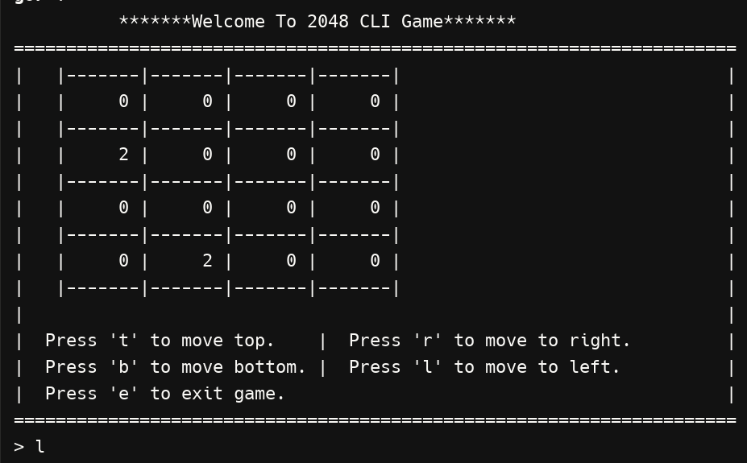
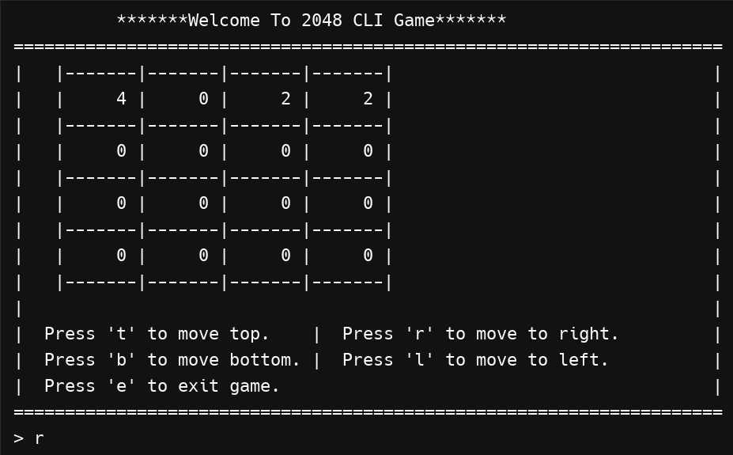
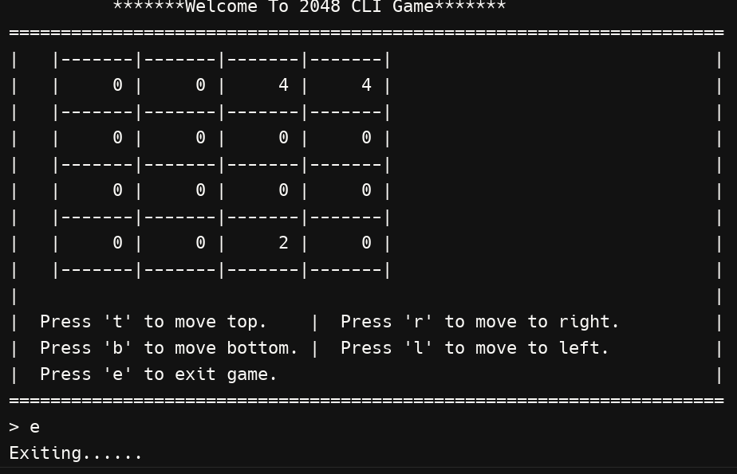

# 2048-cli
2048 Command Line Interface Game
=================
This is a simple implementation of the popular game 2048 in the command line interface.

How to play
------------

* Press 't' to move top.
* Press 'b' to move bottom.
* Press 'r' to move right.
* Press 'l' to move left.
* Press 'e' to exit game.

How to build
------------

* Clone the repository with `git clone https://github.com/kaungminhtet-swe/2048-cli.git`
* Change into the cloned directory with `cd 2048-cli`
* Run `go build` to build the project
* Run `./2048-cli` to start the game

### Game Flow Images

Below are some images showing the flow of playing the 2048 CLI game:

1. **First Move**: The initial state of the game after the first move.
   

2. **Second Moves**: The state of the game after making a few moves.
   

3. **Thrid Moves**: The state of the game after making a few moves.
   

4. **Exiting the game**: The state of the game after making a few moves.
   

Contributing
------------

If you would like to contribute to this project, please fork the repository and submit a pull request with your changes. We welcome any improvements or bug fixes.

License
-------

This project is licensed under the MIT License - see the [LICENSE](./LICENSE) file for details.

Acknowledgments
---------------

- Inspired by the original 2048 game by Gabriele Cirulli.
- Thanks to all the contributors and users for their feedback and support.

Contact
-------
The maintainer of this project is Kaung Min Htet. You can contact him:

- via email at [kgminhtet.dev@gmail.com](mailto:kgminhtet.dev@gmail.com)
- via GitHub at [github.com/kaungminhtet-swe](https://github.com/kaungminhtet-swe)

For any questions or issues, please open an issue in the GitHub repository or contact the maintainer directly.

Happy gaming!